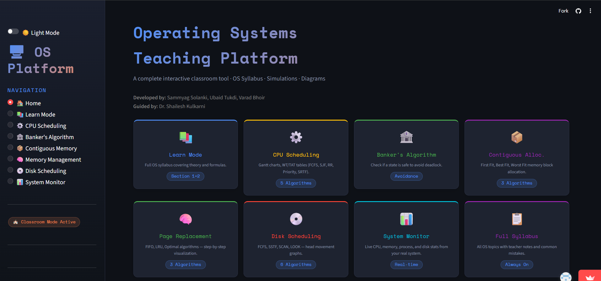
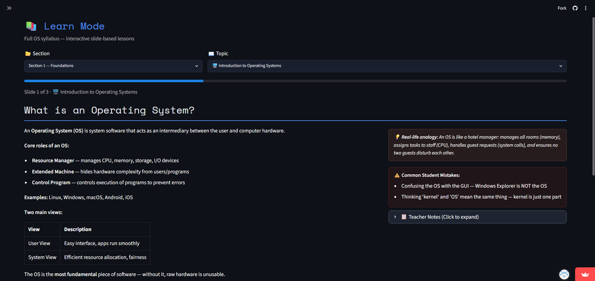
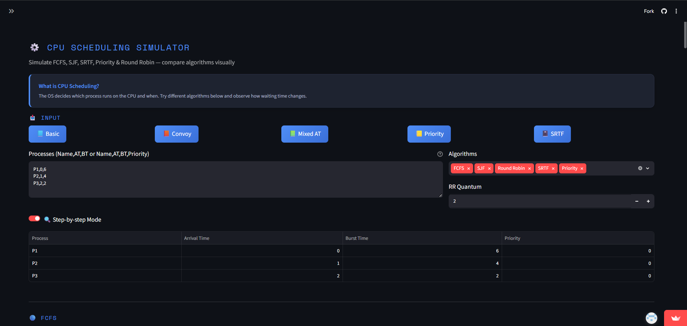
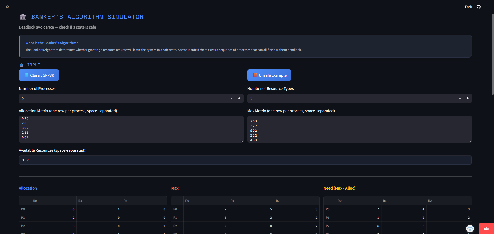
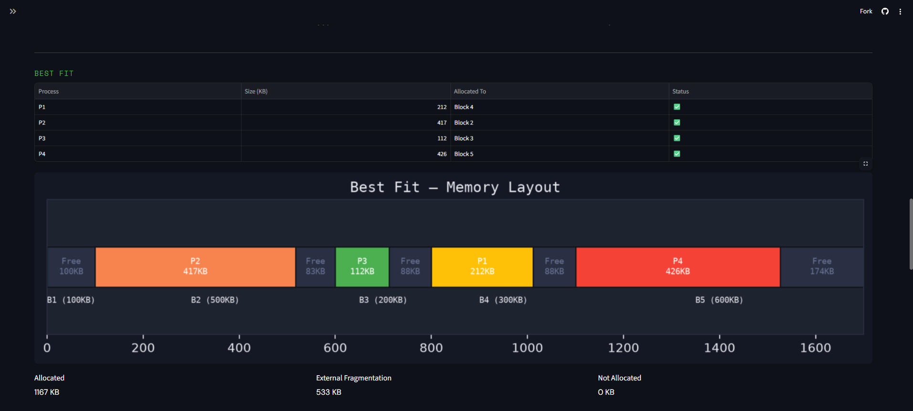
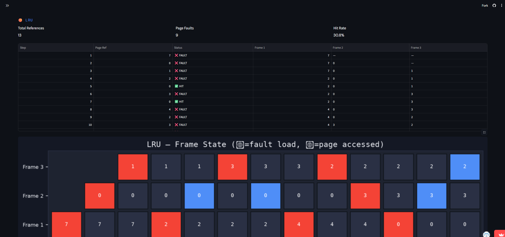
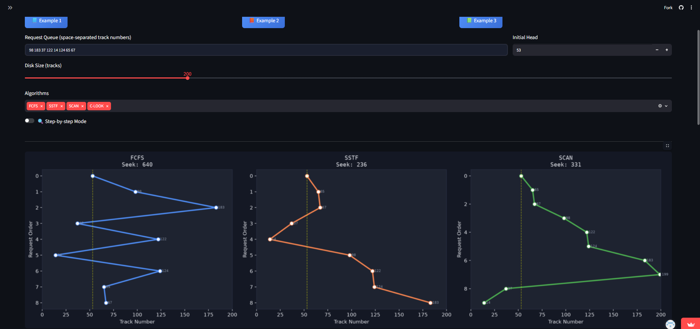
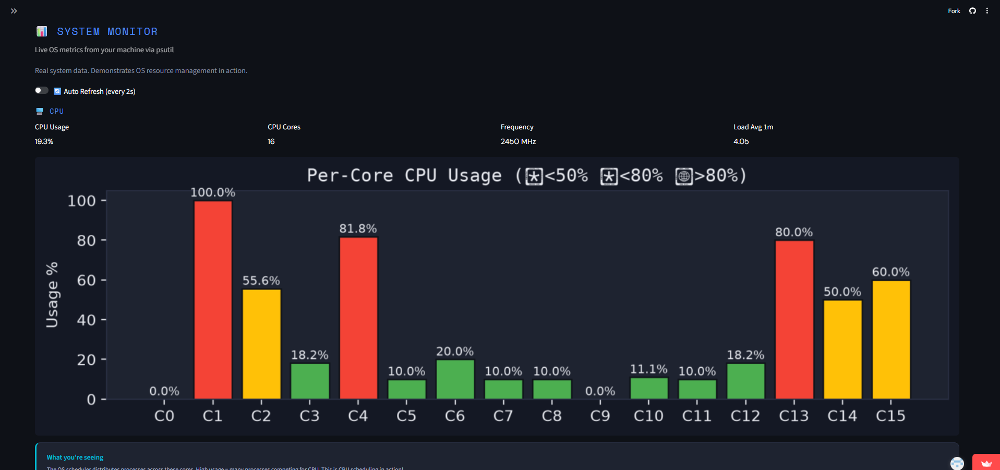

# 🖥️ OS Teaching & Learning Platform

> An interactive web application for learning Operating System concepts through visual simulations, structured theory, and quizzes.

🌐 **Live Demo:** (https://os-teaching-platform-etf2.streamlit.app/)

---

## 📖 Overview

Operating System concepts are often difficult to understand because they are traditionally taught using static diagrams and theoretical explanations. This project transforms those concepts into an interactive learning experience by combining theory, simulations, visualizations, and quizzes within a single web application.

Built using **Python** and **Streamlit**, the platform enables students to experiment with algorithms, compare outputs, and reinforce learning through topic-wise assessments.

---

# ✨ Features

## 📚 Learn Mode

- Structured Operating System syllabus
- Concept explanations
- Teacher notes
- Real-life analogies
- Common mistakes
- Formula highlights
- Quiz after every topic

---

## ⚙️ CPU Scheduling

### Algorithms

- FCFS
- SJF
- SRTF
- Round Robin
- Priority Scheduling

### Features

- Interactive Gantt Chart
- Waiting Time
- Turnaround Time
- Predefined examples
- Manual input

---

## 🏦 Banker's Algorithm

- Deadlock avoidance
- Safe sequence detection
- Resource allocation validation
- Example scenarios

---

## 📦 Contiguous Memory Allocation

Algorithms:

- First Fit
- Best Fit
- Worst Fit
- Next Fit

---

## 🧠 Memory Management

Page Replacement Algorithms

- FIFO
- LRU
- Optimal

Features

- Page Fault Calculation
- Memory Visualization

---

## 💿 Disk Scheduling

Algorithms

- FCFS
- SSTF
- SCAN
- C-SCAN
- LOOK
- C-LOOK

Features

- Head Movement Graph
- Seek Time Calculation

---

## 📊 System Monitor

Displays

- CPU Usage
- Memory Usage
- System Information

> Shows local machine information when run locally and server information when deployed on Streamlit Community Cloud.

---

# 🚀 Key Highlights

- Interactive Learning Platform
- Theory + Simulation + Evaluation
- Topic-wise Quizzes
- Predefined Examples
- Visual Algorithm Demonstrations
- Classroom Friendly
- Responsive Web Interface
- Live Deployment

---

# 📸 Screenshots

## 🏠 Home



---

## 📚 Learn Mode



---

## ⚙️ CPU Scheduling



---

## 🏦 Banker's Algorithm



---

## 📦 Contiguous Memory Allocation



---

## 🧠 Memory Management



---

## 💿 Disk Scheduling



---

## 📊 System Monitor



---

# 🛠️ Technologies Used

- Python
- Streamlit
- Matplotlib
- NumPy
- Pandas
- psutil

---

# 📂 Project Structure

```
os-teaching-platform/
│
├── app.py
├── requirements.txt
├── README.md
└── screenshots/
```

---

# ⚡ Running Locally

Clone the repository

```bash
git clone https://github.com/YOUR_USERNAME/os-teaching-platform.git
```

Navigate to the project

```bash
cd os-teaching-platform
```

Install dependencies

```bash
pip install -r requirements.txt
```

Run

```bash
streamlit run app.py
```

---

# 🔮 Future Improvements

- More Operating System algorithms
- Interactive animations
- Performance comparison dashboard
- Student progress tracking
- Additional educational modules

---

# 👨‍💻 Authors

- Sammyag Solanki
- Ubaid Tukdi
- Varad Bhoir

**Guide:** Dr. Shailesh Kulkarni

---

⭐ If you found this project useful, consider giving it a star!
